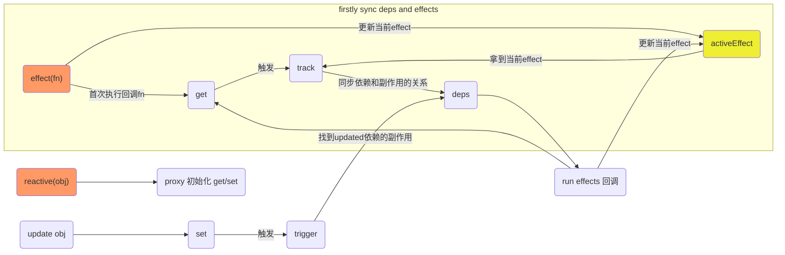

# 响应式基础 API 之 reactive

本篇文章主要介绍一个 API 的实现：`reactive`。
对于响应式系统里，最主要的就是两个 API：`reactive`和`effect`, 分别对应`代理包装`和`添加响应式副作用`的用途。
其他的主要 APIs(readonly, shallow 等功能)也都是基于着两个 API 实现的。

`reactive`和`effect`也是两个互相关联的 API，但在这篇文章中主要先通过`reactive`看看基本的响应式流程，`effect`里相关的`依赖收集`和`触发副作用`的具体细节咱们在下一篇介绍`effect`中再说。

## 基本介绍

开始之前还是先简单看看如何使用的，除了文档，或许看[测试用例](https://github.com/vuejs/core/blob/main/packages/reactivity/__tests__/effect.spec.ts)也是个不错的选择。

一句话概括就是**响应式对象的键值更新可以自动触发依赖这个键值的副作用(就是一个函数的执行)**。

```ts
it('should handle multiple effects', () => {
  let dummy1, dummy2
  const counter = reactive({ num: 0 })
  effect(() => (dummy1 = counter.num))
  effect(() => (dummy2 = counter.num))

  expect(dummy1).toBe(0)
  expect(dummy2).toBe(0)
  counter.num++
  expect(dummy1).toBe(1)
  expect(dummy2).toBe(1)
})
```

上面的用例测试了当`counter`对象`num`键的值改变时，两个 effects 就会响应式地执行。

在这里咱们明确一些名词表述：

- **依赖**：收集依赖时的`依赖`指的是 effect 函数里依赖的`响应式对象对应的键值`，上面用例中，两个 effects 都有一个`counter.num`依赖。
- **副作用**：即每个 effect 函数里的回调，上面用例中`counter.num`有两个副作用。

## 要点概括

### 响应式基本流程结构

首先来看看基本的响应式流程结构：



- 首先通过`reactive`将传入的 obj 对象进行代理，后续更改的都是返回的 proxied 对象。
- 当`触发对象更新`时`set`会找到对应依赖的副作用并执行。
- 当使用`effect`方法时会立即首次执行回调，通过`get`同步`此effect`和`回调里依赖`的相互关系，这样下次`触发对象更新`时就会执行`此effect`了。
- 每次执行`effect回调`之前都会将当前`effect`赋值为一个全局`activeEffect`上，在`track`中同步依赖和副作用的关系。

在以上的流程里，我们不免会有一些问题：

- track 过程如何同步依赖和副作用的关系？
- trigger 过程如何找到对应依赖的副作用？
- 循环触发响应副作用怎么处理？
- 如何自定义控制副作用在依赖更新后的执行时机(scheduler)？

这些问题我们都会在源码中找到答案。

## 具体实现

### createReactiveObject

```ts
export function reactive<T extends object>(target: T): UnwrapNestedRefs<T>
export function reactive(target: object) {
  // if trying to observe a readonly proxy, return the readonly version.
  if (isReadonly(target)) {
    return target
  }
  return createReactiveObject(
    target,
    false,
    mutableHandlers,
    mutableCollectionHandlers,
    reactiveMap
  )
}
```

以上就是具体实现，done, 非常简洁 😝

好吧，主要就是来看`createReactiveObject`函数的实现

```ts
function createReactiveObject(
  target: Target, // 原始对象
  isReadonly: boolean,
  baseHandlers: ProxyHandler<any>,
  collectionHandlers: ProxyHandler<any>,
  proxyMap: WeakMap<Target, any> // <原对象，代理对象>
) {
  if (!isObject(target)) {
    if (__DEV__) {
      console.warn(`value cannot be made reactive: ${String(target)}`)
    }
    return target
  }
  // target is already a Proxy, return it.
  // exception: calling readonly() on a reactive object，因为readonly就是在proxied对象基础之上处理的
  // target[ReactiveFlags.RAW]存的就是original object
  if (
    target[ReactiveFlags.RAW] &&
    !(isReadonly && target[ReactiveFlags.IS_REACTIVE])
  ) {
    return target
  }
  // target already has corresponding Proxy
  const existingProxy = proxyMap.get(target)
  if (existingProxy) {
    return existingProxy
  }
  // only specific value types can be observed.
  const targetType = getTargetType(target)
  if (targetType === TargetType.INVALID) {
    return target
  }
  const proxy = new Proxy(
    target,
    targetType === TargetType.COLLECTION ? collectionHandlers : baseHandlers
  )
  proxyMap.set(target, proxy)
  return proxy
}
```

`createReactiveObject`函数主要做了一下几件事：

- `限制只有对象类型的数据`才能被代理成响应式
- 如果`已经是响应式对象`，则直接返回原对象
- 如果`对同一个对象重复创建响应式`，则直接从对应的 `proxyMap` 中获取对应的 proxied 对象
- 如果`不是可代理的数据类型`，则直接返回原对象

#### target flags

其中原数据对象`target`是一个可能有以下属性的对象，通过这些 flag 属性就可以来判断当前`target`对象的状态。

```ts
export interface Target {
  [ReactiveFlags.SKIP]?: boolean // 跳过响应式代理处理
  [ReactiveFlags.IS_REACTIVE]?: boolean
  [ReactiveFlags.IS_READONLY]?: boolean
  [ReactiveFlags.IS_SHALLOW]?: boolean
  [ReactiveFlags.RAW]?: any // 原始对象
}
```

#### 可代理数据类型

对于可代理的数据类型主要有三类：

- `COMMON`: 普通对象和数组
- `COLLECTION`: Map, Set, WeakMap 和 WeakSet
- `INVALID`: 不可代理的数据类型

其中标记了`ReactiveFlags.SKIP`和`不能扩展属性的对象`也属于`INVALID`类型。

```ts
function getTargetType(value: Target) {
  return value[ReactiveFlags.SKIP] || !Object.isExtensible(value)
    ? TargetType.INVALID
    : targetTypeMap(toRawType(value))
}

function targetTypeMap(rawType: string) {
  switch (rawType) {
    case 'Object':
    case 'Array':
      return TargetType.COMMON
    case 'Map':
    case 'Set':
    case 'WeakMap':
    case 'WeakSet':
      return TargetType.COLLECTION
    default:
      return TargetType.INVALID
  }
}
```

#### mutableHandlers

`createReactiveObject`最主要的部分其实是传入的`baseHandlers`和`collectionHandlers`，即 proxy 的配置函数，包括`get/set`方法的实现。

在`vue3`里目前的 handlers：`mutableHandlers`, `readonlyHandlers`和`shallowReactiveHandlers`，以及`mutableCollectionHandlers`, `shallowCollectionHandlers`, `readonlyCollectionHandlers`和`shallowReadonlyCollectionHandlers`。

对于`reactive`方法，传入的是`mutableHandlers`和`mutableCollectionHandlers`。

这里我们主要看看`mutableHandlers`中`get/set`的实现。

#### get

```ts{50}
get(target: Target, key: string | symbol, receiver: object) {
  const isReadonly = this._isReadonly,
    shallow = this._shallow
  // 处理标记的键值ReactiveFlags
  if (key === ReactiveFlags.IS_REACTIVE) {
    return !isReadonly
  } else if (key === ReactiveFlags.IS_READONLY) {
    return isReadonly
  } else if (key === ReactiveFlags.IS_SHALLOW) {
    return shallow
  } else if (
    // 获取原始值，此时target就是原始值，直接从对应的Map获取返回
    key === ReactiveFlags.RAW &&
    receiver ===
      (isReadonly
        ? shallow
          ? shallowReadonlyMap
          : readonlyMap
        : shallow
          ? shallowReactiveMap
          : reactiveMap
      ).get(target)
  ) {
    return target
  }

  const targetIsArray = isArray(target)

  if (!isReadonly) {
    if (targetIsArray && hasOwn(arrayInstrumentations, key)) {
      // 键值为数组方法时，从我们自己patched的数组方法中获取对应的方法
      return Reflect.get(arrayInstrumentations, key, receiver)
    }
    // edge case
    if (key === 'hasOwnProperty') {
      return hasOwnProperty
    }
  }

  const res = Reflect.get(target, key, receiver)

  // 内置Symbol和一些不能track(不应该响应式)的键值，不进行track，也不需要递归添加响应式
  // isNonTrackableKeys: __proto__, __v_isRef, __isVue
  if (isSymbol(key) ? builtInSymbols.has(key) : isNonTrackableKeys(key)) {
    return res
  }

  // readonly 不用track，因为其本身就不能被更新，所以也不会有后续的trigger。
  if (!isReadonly) {
    track(target, TrackOpTypes.GET, key)
  }

  // shallow不需要递归添加响应式
  if (shallow) {
    return res
  }

  // 对于ref自动解构，除了数组元素和整数key
  if (isRef(res)) {
    // ref unwrapping - skip unwrap for Array + integer key.
    return targetIsArray && isIntegerKey(key) ? res : res.value
  }

  if (isObject(res)) {
    // Convert returned value into a proxy as well. we do the isObject check
    // here to avoid invalid value warning. Also need to lazy access readonly
    // and reactive here to avoid circular dependency.
    // 在一开始new Proxy时，代理只是顶层对象，对于深层对象是没有执行响应式的(Proxy不会deep)，比如proxyMap中是找不到的；
    // 所以我们需要lazily将深层对象reactive/readonly一下
    return isReadonly ? readonly(res) : reactive(res)
  }

  return res
}
```

`get`方法中核心的地方就是`track`函数的调用。后面我们将 track 和`set`里的`trigger`结合起来一起看。

::: details 嵌套对象 lazily 响应式

```ts
if (isObject(res)) {
  return isReadonly ? readonly(res) : reactive(res)
}
```

对于以上代码的原因，我们需要知道 proxy 是不会 deep 将嵌套对象进行拦截的。

```ts
const obj1 = { name: 'leo' }
const obj2 = { o: obj1 }

const proxy = new Proxy(obj2, {
  get(target, key, receiver) {
    return Reflect.get(target, key, receiver)
  },
  set(target, key, value, receiver) {
    return Reflect.set(target, key, value, receiver)
  }
})

console.log(proxy.o.name) // 会触发obj2的get, 因为在访问o.name是得先访问proxy.o
proxy.o.name = 'git' // 不会触发obj1/2的set, 因为修改的是obj1.name的值，而obj1没有被代理。
```

如果我们想要在`proxy.o.name = 'git'`时也触发`set`，则需要对 obj1 也进行代理

```ts
const obj1 = { name: 'leo' }
const obj2 = { o: obj1 }

const proxy = new Proxy(obj2, {
  get(target, key, receiver) {
    const res = Reflect.get(target, key, receiver) // res 就是 obj1
    return new Proxy(res, {
      get(target, key, receiver) {
        return Reflect.get(target, key, receiver)
      },
      set(target, key, value, receiver) {
        return Reflect.set(target, key, value, receiver)
      }
    })
  },
  set(target, key, value, receiver) {
    return Reflect.set(target, key, value, receiver)
  }
})

console.log(proxy.o.name) // obj1/2的get都会触发
proxy.o.name = 'git' // 只会触发obj1的set, 因为修改的是obj1.name的值，而这条语句我们需要先访问proxy.o, 触发obj2的get, 返回的是代理的obj1。
```

最后一条语句`proxy.o.name = 'git'`执行的过程中已经将`obj1`代理了，因为我们需要先访问`proxy.o`, 触发`obj2`的`get`, 所以返回的是代理的`obj1`。

这也是为什么会有以下这条用例

```ts
test('setting a property with an unobserved value should wrap with reactive', () => {
  const observed = reactive<{ foo?: object }>({})
  const raw = {}
  observed.foo = raw
  expect(observed.foo).not.toBe(raw) // 访问了observed, 返回了reactive(raw)
  expect(toRaw(observed.foo)).toBe(raw)
  expect(isReactive(observed.foo)).toBe(true)
})
```

:::

::: details arrayInstrumentations
`arrayInstrumentations`是重写了的数组方法 Record，包括`includes`, `indexOf`, `lastIndexOf`, `push`, `pop`, `shift`, `unshift` 和 `slice`.

为什么要重写呢？proxy 不是已经可以监听数组的变化了吗？

- **无法正确对比对象元素(只读方法)**

```ts
const obj = {}
const arr = [reactive(obj)]

console.log(arr.includes(obj)) // false
console.log(arr.indexOf(obj)) // -1
```

可以看到以上会将原始对象的引用和代理对象的应用进行比较，结果肯定是 false。
我们需要重写需要对比元素的方法，进而可以使用原始对象来对比。主要做的其实就是加了一层响应式解构，获取原始对象再进行比较。

```ts{4,14}
;(['includes', 'indexOf', 'lastIndexOf'] as const).forEach(key => {
  instrumentations[key] = function (this: unknown[], ...args: unknown[]) {
    // 递归解构，这样数组里的所有对象引用都是原始对象引用
    const arr = toRaw(this) as any
    for (let i = 0, l = this.length; i < l; i++) {
      // 为每个index收集依赖
      track(arr, TrackOpTypes.GET, i + '')
    }
    // we run the method using the original args first (which may be reactive)
    const res = arr[key](...args)
    if (res === -1 || res === false) {
      // if that didn't work, run it again using raw values.
      // 参数的解构
      return arr[key](...args.map(toRaw))
    } else {
      return res
    }
  }
})
```

- **改变数组时 length 的改变可能导致死循环副作用[#2138](https://github.com/vuejs/core/pull/2138)**

```ts
const arr = reactive([])

watchEffect(() => {
  arr.push(1)
})

watchEffect(() => {
  arr.push(2)
})
```

第一次`watchEffect`回调执行时会收集`length`依赖，即之后`length`的改变会触发第一个`watchEffect`的回调；
接着第二个`watchEffect`回调执行也会收集`length`依赖，但在最后改变`length`时会触发第一个`watchEffect`的回调，改变`length`，然后又触发第二个`watchEffect`的回调，无穷匮也。

> `watchEffect` 是实际提供给用户使用的 API，`effect`主要是内部使用的更加灵活的 API，具体区别在这里先不赘述了。

```ts{3,5}
;(['push', 'pop', 'shift', 'unshift', 'splice'] as const).forEach(key => {
  instrumentations[key] = function (this: unknown[], ...args: unknown[]) {
    pauseTracking()
    const res = (toRaw(this) as any)[key].apply(this, args)
    resetTracking()
    return res
  }
})
```

我们只要在执行这些 mutable 方法时暂停依赖收集即可，因为这些方法是修改数组，并没用用到对应的值(get)，所以本就不应该收集依赖。
至于如何暂停收集依赖，后面会在`effect`方法的实现中体现。
:::

这里我们简单总结一下`get`做的事情：

- 处理标记的键值 ReactiveFlags：当获取这些键值时，我们直接返回对应的值即可，不需要 track；**注意这些键值是不存在代理对象上的，只是用户访问时我们在`get`中拦截返回对应的值**。
- 对于数组，当键值是数组的某些`方法名`时，从 patched 的`arrayInstrumentations`中获取对应的方法。
- 对于`Symbol`类型键值，一些 builtInSymbols(arguments, caller)以及不能 track 的键值是需要跳过 track 的。
- 对于`readonly`，是不需要 track 的，因为其本身就不能被更新，所以也不会有后续的 trigger。
- 对于`shallow`，是不需要递归添加响应式。
- 对于获取值是`ref`的，自动解构再返回值，除了数组元素和整数 key。
- 对于获取值就是个非响应式对象，为其添加响应式/readonly 再返回。

#### set

```ts{40,42}
set(
  target: object,
  key: string | symbol,
  value: unknown,
  receiver: object
): boolean {
  let oldValue = (target as any)[key]
  // oldValue: readonly & ref, newValue: non-ref, 不允许更新值
  // 比如 1. 当newValue是ref时，不管oldValue是否是readonly都是允许更新的，这样对应键值的readonly就被取消了
  // 2. 当然，如果newValue和oldValue都是ref, 且oldValue是readonly，则不允许了
  if (isReadonly(oldValue) && isRef(oldValue) && !isRef(value)) {
    return false
  }
  if (!this._shallow) { // 这个是在createReactiveObject是设置的值，如果是shallow mode则为true
    // 在非shallow mode，newValue不是shallow也不是readonly时，需要先将new/old value变成原始值
    if (!isShallow(value) && !isReadonly(value)) {
      oldValue = toRaw(oldValue)
      value = toRaw(value)
    }
    // 不是数组响应式对象时，如果oldValue是ref，且newValue不是ref，直接更新oldValue的值即可
    // 因为oldValue的ref会自动触发更新
    if (!isArray(target) && isRef(oldValue) && !isRef(value)) {
      oldValue.value = value
      return true
    }
  } else {
    // in shallow mode, objects are set as-is regardless of reactive or not
  }

  const hadKey =
    isArray(target) && isIntegerKey(key)
      ? Number(key) < target.length
      : hasOwn(target, key)
  const result = Reflect.set(target, key, value, receiver)
  // don't trigger if target is something up in the prototype chain of original
  // 这里target !== toRaw(receiver)的情况我暂时没有想出来。。。
  if (target === toRaw(receiver)) {
    // 这了新增和更新的触发需要进行区分，因为新增我们需要处理一些iteration key的effects，具体后面trigger时会分析。
    if (!hadKey) {
      trigger(target, TriggerOpTypes.ADD, key, value)
    } else if (hasChanged(value, oldValue)) {
      trigger(target, TriggerOpTypes.SET, key, value, oldValue)
    }
  }
  return result
}
```

`set`核心部分当然就是`trigger`方法的调用，同样后面结合`track`一起来看。咱们先简单总结下`set`所做的事情：

- **判断一些不需要 trigger 和更新值的边缘情况**：
  - 当 newValue 是 ref 时，不管 oldValue 是否是 readonly 都是允许更新的，这样对应键值的 readonly 就被取消了
  - 如果 newValue 和 oldValue 都是 ref, 且 oldValue 是 readonly，则不允许更新，毕竟 oldValue 就是应该是个 readonly ref
  - 不是数组响应式对象时，如果 oldValue 是 ref，且 newValue 不是 ref，直接更新 oldValue 的值即可，因为 oldValue 的 ref 会自动触发更新
- **防止 target 为原型链上的对象时的 trigger**：anybody provides some cases?

> 此外`mutableHandlers`还有一些方法的实现：`deleteProperty`, `has` and `ownKeys`，这些方法都类似地通过调用`track`或者`trigger`来处理响应式，[实现](https://github.com/vuejs/core/blob/main/packages/reactivity/src/baseHandlers.ts#L209)比较类似，就不在这里赘述了。

#### trigger

咱们终于要来看最主要的两个部分，`track` and `trigger`。不过天色已晚，下次再继续分析吧。

after a week...

o ha yo u, 咱们趁热打铁，先来看看`trigger`的实现。

```ts
/**
 * Finds all deps associated with the target (or a specific property) and
 * triggers the effects stored within.
 *
 * @param target - The reactive object.
 * @param type - Defines the type of the operation that needs to trigger effects.
 * @param key - Can be used to target a specific reactive property in the target object.
 */
export function trigger(
  target: object,
  type: TriggerOpTypes,
  key?: unknown,
  newValue?: unknown,
  oldValue?: unknown,
  oldTarget?: Map<unknown, unknown> | Set<unknown>
) {
  const depsMap = targetMap.get(target)
  if (!depsMap) {
    // never been tracked
    return
  }

  // 添加需要处理的deps (deps就是effects set)
  let deps: (Dep | undefined)[] = []
  if (type === TriggerOpTypes.CLEAR) {
    // collection being cleared
    // trigger all effects for target
    deps = [...depsMap.values()]
  } else if (key === 'length' && isArray(target)) {
    const newLength = Number(newValue)
    depsMap.forEach((dep, key) => {
      // 当数组的length变小，之前大于当前length的索引键值的effects都要被添加，相当于removed trigger
      // 新增索引的effects在下面TriggerOpTypes.ADD case下添加了
      if (key === 'length' || (!isSymbol(key) && key >= newLength)) {
        deps.push(dep)
      }
    })
  } else {
    // schedule runs for SET | ADD | DELETE
    if (key !== void 0) {
      // 提供了key就把对于key的deps添加上
      deps.push(depsMap.get(key))
    }

    // also run for iteration key on ADD | DELETE | Map.SET
    // 因为新增或者删除，都会影响对应target的遍历结果
    switch (type) {
      case TriggerOpTypes.ADD:
        if (!isArray(target)) {
          deps.push(depsMap.get(ITERATE_KEY))
          if (isMap(target)) {
            // MAP_KEY_ITERATE_KEY是在只是遍历keys时才会被对应effect收集的依赖。
            deps.push(depsMap.get(MAP_KEY_ITERATE_KEY))
          }
        } else if (isIntegerKey(key)) {
          // 新增索引时，length的effects也需要被trigger
          // new index added to array -> length changes
          deps.push(depsMap.get('length'))
        }
        break
      case TriggerOpTypes.DELETE:
        // 数组元素的删除操作会trigger上面key === 'length' && isArray(target)的effects，所以这里不需要处理
        if (!isArray(target)) {
          deps.push(depsMap.get(ITERATE_KEY))
          if (isMap(target)) {
            deps.push(depsMap.get(MAP_KEY_ITERATE_KEY))
          }
        }
        break
      case TriggerOpTypes.SET:
        if (isMap(target)) {
          deps.push(depsMap.get(ITERATE_KEY))
        }
        break
    }
  }

  const eventInfo = __DEV__
    ? { target, type, key, newValue, oldValue, oldTarget }
    : undefined

  if (deps.length === 1) {
    if (deps[0]) {
      if (__DEV__) {
        triggerEffects(deps[0], eventInfo)
      } else {
        triggerEffects(deps[0])
      }
    }
  } else {
    // 如果有多个deps，需要把所有deps里的effects gather到一起，重写组成一个deps再处理
    const effects: ReactiveEffect[] = []
    for (const dep of deps) {
      if (dep) {
        effects.push(...dep)
      }
    }
    if (__DEV__) {
      triggerEffects(createDep(effects), eventInfo)
    } else {
      triggerEffects(createDep(effects))
    }
  }
}
```

[void 0 or undefined](https://stackoverflow.com/questions/19369023/should-i-use-void-0-or-undefined-in-javascript)

`trigger`方法做的事情注释已经说的很清楚了：`Finds all deps associated with the target (or a specific property) and triggers the effects stored within.`

主要就是**找到所有的 effects**，因为`trigger`不一定只是触发对应的 key(如果提供了参数)的 deps，像数组，collection 类型对象，可能会需要触发`length`和`ITERATE_KEY`。

- `collection`类型被`clear`了，直接触发所有 key 的`effects`
- key 是数组的`length`时，除了`length`本身的`effects`，还要触发被删除的索引 key 的`effects`(如果 length 变小)。
- 对于剩下的其他情况，首先将`provided key`的`effects`添加上，然后处理是否需要添加额外的`iteration key`。
  - `TriggerOpTypes.ADD`: 如果是新增 key，对于`collection`类型添加`ITERATE_KEY`的`effects`，`Map`类型还需加`MAP_KEY_ITERATE_KEY`的`effects`；数组的话需要添加`length`的`effect`。
  - `TriggerOpTypes.DELETE`: 如果是删除 key，对于`collection`类型的处理和新增 key 时一样；此时不需要处理数组类型被删索引 key 的`effects`了，因为会在处理`length`key 时将删索引 key 的`effects`加上。
  - `TriggerOpTypes.SET`: `Map`的`set`操作，只需要再添加`ITERATE_KEY`的`effects`就行了，因为 key 没有变化，所以不需要`MAP_KEY_ITERATE_KEY`的`effects`。

对于**触发 effects**就非常简单了。对于需要触发多个`deps`的`effects`，将所有 deps 里的 effects gather 到一起，重写组成一个 deps 再处理即可，然后交给`triggerEffects`方法处理。

```ts
export function triggerEffects(
  dep: Dep | ReactiveEffect[],
  debuggerEventExtraInfo?: DebuggerEventExtraInfo
) {
  // spread into array for stabilization
  const effects = isArray(dep) ? dep : [...dep]
  for (const effect of effects) {
    if (effect.computed) {
      triggerEffect(effect, debuggerEventExtraInfo)
    }
  }
  for (const effect of effects) {
    if (!effect.computed) {
      triggerEffect(effect, debuggerEventExtraInfo)
    }
  }
}
```

`triggerEffects`方法做的事情就是将`computed effects`和`非computed effects`分离开触发，且保证前者先触发完。至于`computed effects`的来源和用法，咱们暂时不去深究，目测是和`computed`相关。

那现在就剩最后的`triggerEffect`方法了，用来真正的 run 一下对应`effect`的回调。

```ts
function triggerEffect(
  effect: ReactiveEffect,
  debuggerEventExtraInfo?: DebuggerEventExtraInfo
) {
  // 防止递归执行
  if (effect !== activeEffect || effect.allowRecurse) {
    if (__DEV__ && effect.onTrigger) {
      effect.onTrigger(extend({ effect }, debuggerEventExtraInfo))
    }
    if (effect.scheduler) {
      effect.scheduler()
    } else {
      effect.run()
    }
  }
}
```

首先是防止递归的判断：`effect !== activeEffect || effect.allowRecurse`。
通过`effect !== activeEffect`可以防止以下情况。

```ts
const obj = reactive({ name: 'leo' })
effect(() => {
  // 收集了依赖
  console.log(obj.name)
  // 紧接着就触发了，导致循环
  obj.name = 'pit'
})
```

其次就是判断是否有`scheduler`这东西，有就执行`scheduler`，否则就触发对应回调。

`scheduler`就是咱们用来自定义`effects`的`执行时机`的，因为我们可以知道`scheduler`回调的调用就是`effect`本应该被执行的时候，但我就吊着你，先不执行。

那我们就可以 schedule 一下例如触发实际渲染前多次修改响应式值的情况了，防止短时间内的重复渲染。

#### track

OK，现在知道了触发过程，咱们就得看看那些`effects`是如果被关联到对应 key 的`deps`中的。

我们知道`track`函数的调用是在对应 key 的代理被`get`时，所以在执行某个`effect`回调时，只要`get`了一下对应的 key，那么就会调用`track`。

```ts
/**
 * Tracks access to a reactive property.
 *
 * This will check which effect is running at the moment and record it as dep
 * which records all effects that depend on the reactive property.
 *
 * @param target - Object holding the reactive property.
 * @param type - Defines the type of access to the reactive property.
 * @param key - Identifier of the reactive property to track.
 */
export function track(target: object, type: TrackOpTypes, key: unknown) {
  // 当然只有activeEffect存在才需要track
  // shouldTrack就是用来控制之前提到的暂停收集的标识，具体怎么设置还得后面再说
  // shouldTrack && activeEffect都是effect.js的闭包变量
  if (shouldTrack && activeEffect) {
    // 就是获取/初始化dep(Set<effects>)的过程，
    let depsMap = targetMap.get(target)
    if (!depsMap) {
      targetMap.set(target, (depsMap = new Map()))
    }
    let dep = depsMap.get(key)
    if (!dep) {
      depsMap.set(key, (dep = createDep()))
    }

    const eventInfo = __DEV__
      ? { effect: activeEffect, target, type, key }
      : undefined

    trackEffects(dep, eventInfo)
  }
}
```

`activeEffect`是个`Effect`对象，里面有其对应的回调函数，以及其它一些 meta 信息，用来存放`deps`以及实现后续的其他功能等。

主要来看看`trackEffects`，里面已经开始出现`effect`方法涉及的相关逻辑了，但咱们先忽略，后面再结合`effect`来分析。

```ts{20,21}
export function trackEffects(
  dep: Dep,
  debuggerEventExtraInfo?: DebuggerEventExtraInfo
) {
  let shouldTrack = false
  // effectTrackDepth & maxMarkerBits都是effect.js的闭包变量
  // 用来记录最大effect递归层数，这里先提一嘴，具体后面再说
  if (effectTrackDepth <= maxMarkerBits) {
    if (!newTracked(dep)) {
      dep.n |= trackOpBit // set newly tracked
      shouldTrack = !wasTracked(dep)
    }
  } else {
    // Full cleanup mode.
    shouldTrack = !dep.has(activeEffect!)
  }

  if (shouldTrack) {
    // 这里就是effect和其对应依赖关系的形成之处！
    dep.add(activeEffect!)
    activeEffect!.deps.push(dep)
    if (__DEV__ && activeEffect!.onTrack) {
      activeEffect!.onTrack(
        extend(
          {
            effect: activeEffect!
          },
          debuggerEventExtraInfo!
        )
      )
    }
  }
}
```

可以看到，对应的`dep`Set 会把`activeEffect`添加进去，而`activeEffect`会把对应的`dep`加进自己的`deps`数组里。

接下来，我们就得看看`effect`方法的实现以及其和以上我们的`trigger`&`track`的关系了。
