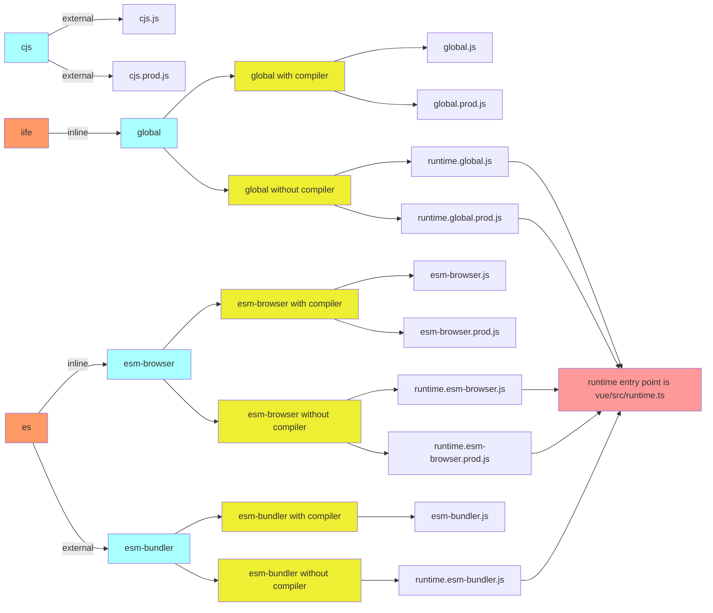
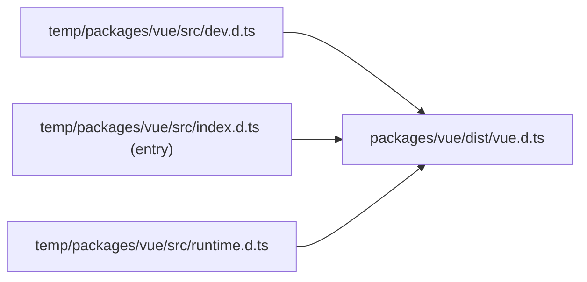

对于打包相关命令，主要基于[scripts/build.js](https://github.com/vuejs/core/blob/main/scripts/build.js)这个脚本，以及`rollup.config.js`和`rollup.dts.config.js`所以了解了这个脚本和 rollup 的配置，我们就基本了解了`package.json`下所有的打包相关命令了。

此外`rollup.config.js`会用到[scripts/aliases.js](#aliases脚本)和[scripts/const-enum.js](#const-enum脚本)

```json
{
  "build": "node scripts/build.js",
  "build-dts": "tsc -p tsconfig.build.json && rollup -c rollup.dts.config.js",
  "build-sfc-playground": "run-s build-compiler-cjs build-runtime-esm build-ssr-esm build-sfc-playground-self",
  "build-compiler-cjs": "node scripts/build.js compiler reactivity-transform shared -af cjs",
  "build-runtime-esm": "node scripts/build.js runtime reactivity shared -af esm-bundler && node scripts/build.js vue -f esm-bundler-runtime && node scripts/build.js vue -f esm-browser-runtime",
  "build-ssr-esm": "node scripts/build.js compiler-sfc server-renderer -f esm-browser",
  "build-sfc-playground-self": "cd packages/sfc-playground && npm run build",

  "size": "run-s size-global size-baseline",
  "size-global": "node scripts/build.js vue runtime-dom -f global -p",
  "size-baseline": "node scripts/build.js vue -f esm-bundler-runtime && node scripts/build.js runtime-dom runtime-core reactivity shared -f esm-bundler && cd packages/size-check && vite build && node brotli"
}
```

我们会首先看看是如何使用这个脚本来打包的，以及过一遍[每种打包格式的介绍](https://github.com/vuejs/core/blob/main/packages/vue/README.md#which-dist-file-to-use)，接着对于实现会主要关注以下几点：

- [具体打包一个包的实现与配置](#打包单个包)
- [并行打包](#并行打包流程)
- [打包类型声明文件](#打包类型声明)
- 打包后检查包大小的方法
- 了解[const-enum.js](#const-enum-js)是如何做扫描和缓存的

## 使用

脚本可以用来并行打多个包，打包名称支持模糊搜索，不提供则打包所有。

```bash
$ node scripts/build.js runtime-core runtime-dom
# or fuzzy matching，do not forget the -a option
$ node scripts/build.js runtime -a
```

下面是具体可选的参数：

- `-f (formats)`: 指定[打包格式](#打包格式)；[文档](https://github.com/vuejs/core/blob/main/.github/contributing.md#build-formats)里说可以支持指定多种打包格式，用","隔开，但是目前应该还是一个没有修复的小[issue](https://github.com/vuejs/core/issues/2448)。默认格式为`esm-bundler`和`cjs`，配置在`rollup.config.js`。
- `-d (devOnly)`: 是否只打包开发代码；默认就是 false。
- `-p (prodOnly)`: 是否只打包生产代码；默认就是 false。如果同时制定了`-d`和`-p`，`-d`优先级高。
- `-t (buildTypes)`: 是否打包类型声明文件。
- `-s (sourceMap)`: 是否打包输出 sourcMap 文件。
- `-a (buildAllMatching)`: 在模糊搜索时是否将所有匹配到的包都打包，false 则打包第一个匹配到的(按包目录名称顺序)。
- `--release`: 是否是 release 状态。

## 打包格式

在前面已经提到了很多次各种打包格式(formats)了，那么在这里再对每种介绍一遍。

### 基本关系图

对于`rollup`来说主要`formats`有三种，`iife`, `cjs`和`es`。基于此三类，我们再根据`external`, `入口文件`和`生产/开发`环境区分出不同的打包格式(输出不同的文件)。



### 具体描述

- **global**:
  - 通过`iife`的方式打包
  - `inline`所有依赖包
  - 包的名字，即挂载到全局对象上的变量名，会在对应的`package.json`里`buildOptions.name`指定；通常就是用于`<script src="...">`的方式(e.g. CDN)引入时；`<script src="https://cdn.jsdelivr.net/npm/vue/dist/vue.global.prod.js">`或者`<script src="https://cdn.jsdelivr.net/npm/vue">`(注意后面没有`/`，[默认指向](./dev.md#引包规则)`vue.global.js`)
  - 生成的文件有`<包对应的名字>.global(.prod).js`
  - 对于`vue`包会多一种打包规则：`global-runtime`，生成`vue(.runtime).global(.prod).js`，表示只包含`runtime`的的代码，没有包含`编译系统`。
- **cjs**:
  - 打包成在`node`环境下可用`require`的方式引入的格式；用在`ssr`
  - `external`所有依赖包
  - 生成的文件有`<包对应的名字>.cjs(.prod).js`
- **esm-browser**:
  - 打包成`esm`模块供浏览器使用，如`<script type="module">`通过`CDN`引入`https://cdn.jsdelivr.net/npm/vue@next/dist/vue.esm-browser.js`
  - `inline`所有依赖包
  - 生成的文件有`<包对应的名字>.esm-browser(.prod).js`
  - 对于`vue`包会多一种打包规则：`esm-browser-runtime`，生成`vue(.runtime).esm-browser(.prod).js`，表示只包含`runtime`的的代码，没有包含`编译系统`。
- **esm-bundler**:
  - 用于用户自己处理打包问题和选择打包工具(bundler)，如使用`webpack`, `rollup`和`parcel`；
  - 类似于`cjs`格式(也是自己处理 bundler)，只是以`esm`模块的方式提供
  - `external`所有依赖包；所以开发时有提供[dev-esm](./dev.md#dev-esm)命令
  - 生成的文件有`<包对应的名字>.esm-bundler.js`；注意没有`prod`，因为需要我们自己处理打包问题如压缩代码等
  - 对于`vue`包会多一种打包规则：`esm-bundler-runtime`，生成`vue(.runtime).esm-browser.js`，表示只包含`runtime`的的代码，没有包含`编译系统`。

## 实现

`build.js`脚本的整体执行顺序是：`处理可选参数` -> `扫描缓存enum` -> [并行](#并行打包流程)[打包](#打包单个包) -> `检查包大小` -> [打包类型声明文件](#打包类型声明)。

[可选参数](#使用)上面已经介绍了；对于[const-enum.js](#const-enum脚本)的`scanEnums`方法如何`扫描缓存enum`的，因为涉及代码的语法解析，我们放在[最后](#babel处理ast)再去分析，我们只需要知道此方法可以帮我们缓存所有的 enum 变量，然后再并行打包时复用；所以接下来我们来看主要打包过程。

### 打包单个包

对于并行打包，最终还是回到通过脚本执行单个打包的逻辑，所以我们先看看打一个包的主要内容。主要涉及脚本里的`build`方法和`rollup.config.js`。

#### build

`build`方法其实主要就是调用`rollup -c --environment <环境变量>`并处理所需参数。其中有以下几点逻辑：

- 如果在`isRelease`状态，且没有指定打包的包(all)，其会忽略`private`包(虽然在过滤匹配包时已经处理了)
- 如果有指定打包的格式，那么就不移除已存在的`dist`文件夹

接着交给`rollup`处理

```js
await execa(
  'rollup',
  [
    '-c',
    '--environment',
    [
      `COMMIT:${commit}`,
      `NODE_ENV:${env}`,
      `TARGET:${target}`, // 包名
      formats ? `FORMATS:${formats}` : ``,
      prodOnly ? `PROD_ONLY:true` : ``,
      sourceMap ? `SOURCE_MAP:true` : ``
    ]
      .filter(Boolean)
      .join(',')
  ],
  { stdio: 'inherit' }
)
```

#### rollup.config.js

主要打包的逻辑应该在`rollup`配置文件里。

在脚本`build`方法里跳用`rollup`命令后会通过`--environment`参数提供环境变量给`rollup.config.js`，所以`rollup.config.js`通过不同的参数生成不同的`rollup`配置。

::: tip
最终的配置是一个数组，会根据有多少种`格式(formats)`以及`生产/开发`环境来确定配置数组，配置数组的个数对应就是最后输出不同打包文件的个数，具体文件类型可看[格式关系图](#基本关系图)。
:::

首先我们看看整体是如何生成配置数组的。

```js{3,11,14}
const packageConfigs = process.env.PROD_ONLY
  ? []
  : packageFormats.map(format => createConfig(format, outputConfigs[format]))

if (process.env.NODE_ENV === 'production') {
  packageFormats.forEach(format => {
    if (packageOptions.prod === false) {
      return
    }
    if (format === 'cjs') {
      packageConfigs.push(createProductionConfig(format))
    }
    if (/^(global|esm-browser)(-runtime)?/.test(format)) {
      packageConfigs.push(createMinifiedConfig(format))
    }
  })
}

export default packageConfigs
```

可以看到主要用是`createConfig`, `createProductionConfig`和`createMinifiedConfig`三个方法创建一个配置对象。其中`createProductionConfig`和`createMinifiedConfig`也是基于`createConfig`的。

- `createProductionConfig`: 只是简单的打包成`.prod.js`文件，**单独对`cjs`格式处理**；但是和`直接用createConfig`一样，并没有压缩代码，所以**最终`cjs.js`和`cjs.prod.js`文件内容是一样的**，原因暂不清楚
- `createMinifiedConfig`: 打包`.prod.js`文件，利用[@rollup/plugin-terser](https://www.npmjs.com/package/@rollup/plugin-terser)压缩了代码

在`开发`环境时只会直接用`createConfig`生成配置；生产环境会额外(除非 prodOnly)加入`.prod.js`文件。我们主要来看一下`createConfig`方法里的以下几点：

**打包入口文件**

主要是区分了`runtime-only`和`包含comelier`的入口。对于`@vue/compat`包进一步区分了`esm`和`non-esm`的入口文件。

```js
let entryFile = /runtime$/.test(format) ? `src/runtime.ts` : `src/index.ts`

// the compat build needs both default AND named exports. This will cause
// Rollup to complain for non-ESM targets, so we use separate entries for
// esm vs. non-esm builds.
if (isCompatPackage && (isBrowserESMBuild || isBundlerESMBuild)) {
  entryFile = /runtime$/.test(format)
    ? `src/esm-runtime.ts`
    : `src/esm-index.ts`
}
```

**rollup-plugin-esbuild**

build 的过程其实也是用了`esbuild`进行处理的，主要通过[rollup-plugin-esbuild](https://www.npmjs.com/package/rollup-plugin-esbuild)插件实现。

部分代码如下：

```js
import esbuild from 'rollup-plugin-esbuild'

function createConfig() {
  // rollup config object
  return {
    plugins: [
      // [!code focus:8]
      esbuild({
        tsconfig: path.resolve(__dirname, 'tsconfig.json'),
        sourceMap: output.sourcemap,
        minify: false, // [!code warning] // 不使用esbuild插件进行代码压缩
        target: isServerRenderer || isNodeBuild ? 'es2019' : 'es2015',
        define: resolveDefine() // [!code warning] // 定义打包注入的变量
      })
    ]
  }
}
```

其中代码压缩(.prod.js)并没有用这个插件去处理，而是通过前面提到的`createMinifiedConfig`方法利用[@rollup/plugin-terser](https://www.npmjs.com/package/@rollup/plugin-terser)进行压缩，因为后者能够压缩更小体积的代码。

`define: resolveDefine()`这里就是定义[注入的变量](https://github.com/vuejs/core/blob/main/packages/global.d.ts)。

**打包变量注入/替换**

::: info
以下**注入/替换**统一称作**注入**
:::

在注入时用到了两个方法：`resolveDefine`和`resolveReplace`。 `resolveDefine`就是普通的定义需要注入的变量的值：

```js
// define object
{
  __VERSION__: '"3.3.2"'
}

// before bundling
console.log(__VERSION__)

// after bundling
console.log('3.3.2')
```

`resolveReplace`也是用来生成注入变量的对象`(待注入的key - 注入的值)`的，不同之处在于`resolveDefine`直接将生成的对象提供给`rollup-plugin-esbuild`插件处理，`resolveReplace`是通过[@rollup/plugin-replace](https://www.npmjs.com/package/@rollup/plugin-replace)插件进行处理的。

原因是`rollup-plugin-esbuild`插件处理注入时会严格限定`注入的值`为`valid JSON syntax`，所以我们需要通过`@rollup/plugin-replace`注入这些特殊的值。

```js
// e.g.
{
  'process.env': '({})',
  'context.onError(': `/*#__PURE__*/ context.onError(`,
}

// rollup-plugin-esbuild will throw error:
// error: Invalid define value (must be an entity name or valid JSON syntax)
```

对于打包时的`别名识别`和注入`enum`类型的处理分别涉及脚本`aliases.js`和`const-enum.js`。

#### [aliases 脚本](https://github.com/vuejs/core/blob/main/scripts/aliases.js)

这个脚本就是为了获取`别名`的`entries`定义，使`别名`对应到`packages/<包名>/src/index.ts`。

每个包引用的别名规则是`@vue/<对应`packages`下目录名>`，除了辅助工具包(不需要应用别名): `sfc-playground`, `size-check`, `template-explorer`和`dts-test`以及以下几个包：

| 包目录名        |        别名         |
| --------------- | :-----------------: |
| vue             |         vue         |
| compiler-sfc    |  vue/compiler-sfc   |
| server-renderer | vue/server-renderer |
| vue-compat      |     @vue/compat     |

#### [const-enum 脚本](https://github.com/vuejs/core/blob/main/scripts/const-enum.js)

由于通过`rollup-plugin-esbuild`插件在`insolation mode`打包会将`const enum`类型编译进运行时，此举会减慢打包速度以及最终打包出来的体积。所以脚本会将`const enum`类型通过上面提到的`resolveReplace`注入掉。最终比较如下：

::: code-group

```ts [源码]
export const enum Test {
  TEST = 'TEST'
}

console.log(Test.TEST)
```

```js [打包后(cjs)]
var Test = /* @__PURE__ */ (Test2 => {
  Test2['TEST'] = 'TEST'
  return Test2
})(Test || {})

console.log('TEST' /* TEST */)
exports.Test
```

```js [使用脚本工具后打包]
console.log('TEST')
// 此处没有exports，因为其他import了Test的地方也会直接替换
```

:::

具体实现我们放在[最后](#babel处理ast)分析。其主要提供了三个东西：

- `scanEnum方法`：扫描出仓库里匹配`export const enum`的`const enum`类型，然后将数据 cache 住直至所有包并行打包完成
- `enumPlugin插件`：在`const enum`类型注入后移除`export const enum`语句；在`rollup-plugin-esbuild`插件之前处理，所以对于`esbuild`处理阶段`const enum`类型已经被注入实际对应的值，不用再处理了。
- `enumDefines注入对象`：`scanEnum`cache 的数据，`enum表达式`为键，实际值为值；e.g. `export const enum Test { TEST = 'TEST' }` -> `{ 'Test.TEST': 'TEST' }`

### 并行打包流程

### 打包类型声明

在将所有指定包打包完后，通过`-t (buildTypes)`选项可以选择是否同时打包输出类型声明文件。其过程就是执行了`rollup`相关命令。

```js
if (buildTypes) {
  await execa(
    'pnpm',
    [
      'run',
      'build-dts',
      ...(targets.length // targets 是要提供模糊搜索的名字数组
        ? // resolvedTargets 是通过targets解析出来的包名数组
          ['--environment', `TARGETS:${resolvedTargets.join(',')}`]
        : [])
    ],
    {
      stdio: 'inherit'
    }
  )
}
```

可以看到执行的是`pnpm build-dts`，对应于`tsc -p tsconfig.build.json && rollup -c rollup.dts.config.js`。

首先通过`tsc`基于`tsconfig.build.json`文件将所有包 src 下的代码的类型声明文件编译出来，然后再用`rollup`将每个包对应的类型声明文件打包进一个文件并输出于对应的`dist`文件中。

#### [tsconfig.build.json](https://github.com/vuejs/core/blob/main/tsconfig.build.json)

这个文件是 extends 于`tsconfig.json`的，里面我们主要关注一下几个配置：

- **compilerOptions.outDir**: 编译输出的文件夹，此处值为`temp`，所以`tsc -p tsconfig.build.json`之后就会在`temp`文件夹生成**每个文件对应的类型声明文件**(即 src 目录及文件名和源码一样的结构)
- **compilerOptions.declaration**: 值为`true`，生成类型声明文件
- **compilerOptions.emitDeclarationOnly**: 值为`true`，**只**生成类型声明文件

#### [rollup.dts.config.js](https://github.com/vuejs/core/blob/main/rollup.dts.config.js)

此配置文件主要是将前面生成在`temp`里的类型声明文件打包成一个整体的`<包名>.d.ts`文件，并输出到对应包的`dist`中。
其会根据`temp/<package>/src/index.d.ts`为入口文件进行打包，**打包格式为`esm`**，且不会`inline`依赖包的类型。

例如`vue`的打包过程：



::: details patchTypes plugin
里面用到了[rollup-plugin-dts](https://www.npmjs.com/package/rollup-plugin-dts)和一个自定义插件`patchTypes`，我们主要来看看自定义插件`patchTypes`。

具体实现因为涉及`babel`解析`ast`，需要了解一些`ast`的属性，所以和`扫描缓存enum`部分一样，我们留在[最后](#babel处理ast)进行分析。我们先看看其主要做了什么：

- **移除所有标记了@internal 的类型属性**

export 的类型，以及`type`, `interface`, `class`里的属性只要标记了`@internal`就不会打包进去。

```ts
export type SSRContext = {
  [key: string]: any
  teleports?: Record<string, string>
  /**
   * @internal
   */
  __teleportBuffers?: Record<string, SSRBuffer>
  /**
   * @internal
   */
  __watcherHandles?: (() => void)[]
}

// after bundling
export type SSRContext = {
  [key: string]: any
  teleports?: Record<string, string>
  /* removed internal: __teleportBuffers */
  /* removed internal: __watcherHandles */
}
```

- **将 export 里所有的类型转化为 inline 导出的形式**

```ts
type Foo = number
type Bar = string
export { Foo, Bar }

// ->
export Foo = number
export Bar = string
```

如果不转换，会在 vitepress `defineComponent`里报`the inferred type cannot be named without a reference`，暂时不清楚为啥。

- **追加自定义的一些额外类型声明**

这一步会将对应包`packages/${pkg}/types`文件夹下的所有类型声明一个个追加到打包好的整体声明文件末尾。

`packages/${pkg}/types`下的文件不会纳入编译，`tsc -p tsconfig.build.json`只包含了`packages/${pkg}/src`下的文件。

```ts
// packages/vue/types/jsx-register.d.ts
import '../jsx'

// packages/vue/distvue.d.ts
...
export { compileToFunction as compile };
...
import '../jsx'
```

:::

## babel 处理 ast
