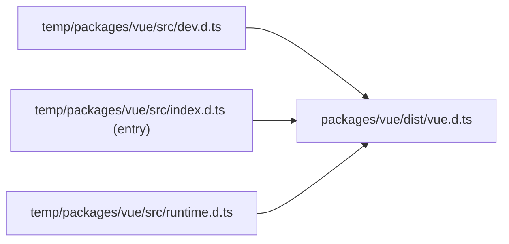

对于打包相关命令，主要基于[scripts/build.js](https://github.com/vuejs/core/blob/main/scripts/build.js)这个脚本，以及`rollup.config.js`和`rollup.dts.config.js`所以了解了这个脚本和 rollup 的配置，我们就基本了解了`package.json`下所有的打包相关命令了。

```json
{
  "build": "node scripts/build.js",
  "build-dts": "tsc -p tsconfig.build.json && rollup -c rollup.dts.config.js",
  "build-sfc-playground": "run-s build-compiler-cjs build-runtime-esm build-ssr-esm build-sfc-playground-self",
  "build-compiler-cjs": "node scripts/build.js compiler reactivity-transform shared -af cjs",
  "build-runtime-esm": "node scripts/build.js runtime reactivity shared -af esm-bundler && node scripts/build.js vue -f esm-bundler-runtime && node scripts/build.js vue -f esm-browser-runtime",
  "build-ssr-esm": "node scripts/build.js compiler-sfc server-renderer -f esm-browser",
  "build-sfc-playground-self": "cd packages/sfc-playground && npm run build",

  "size": "run-s size-global size-baseline",
  "size-global": "node scripts/build.js vue runtime-dom -f global -p",
  "size-baseline": "node scripts/build.js vue -f esm-bundler-runtime && node scripts/build.js runtime-dom runtime-core reactivity shared -f esm-bundler && cd packages/size-check && vite build && node brotli"
}
```

我们会首先看看是如何使用这个脚本来打包的，以及过一遍[每种打包格式的介绍](https://github.com/vuejs/core/blob/main/packages/vue/README.md#which-dist-file-to-use)，接着对于实现会主要关注以下几点：

- [具体打包一个包的实现与配置](#打包单个包)
- [并行打包](#并行打包流程)
- [打包类型声明文件](#打包类型声明)
- 打包后检查包大小的方法
- 了解`scanEnums`函数是如何做扫描和缓存的

## 使用

脚本可以用来并行打多个包，打包名称支持模糊搜索，不提供则打包所有。

```bash
$ node scripts/build.js runtime-core runtime-dom
# or fuzzy matching，do not forget the -a option
$ node scripts/build.js runtime -a
```

下面是具体可选的参数：

- `-f (formats)`: 指定[打包格式](#打包格式)；[文档](https://github.com/vuejs/core/blob/main/.github/contributing.md#build-formats)里说可以支持指定多种打包格式，用","隔开，但是目前应该还是一个没有修复的小[issue](https://github.com/vuejs/core/issues/2448)。默认格式为`esm-bundler`和`cjs`，配置在`rollup.config.js`。
- `-d (devOnly)`: 是否只打包开发代码；默认就是 false。
- `-p (prodOnly)`: 是否只打包生产代码；默认就是 false。如果同时制定了`-d`和`-p`，`-d`优先级高。
- `-t (buildTypes)`: 是否打包类型声明文件。
- `-s (sourceMap)`: 是否打包输出 sourcMap 文件。
- `-a (buildAllMatching)`: 在模糊搜索时是否将所有匹配到的包都打包，false 则打包第一个匹配到的(按包目录名称顺序)。
- `--release`: 是否是 release 状态。

## 打包格式

在前面已经提到了很多次各种打包格式(formats)了，那么在这里再对每种介绍一遍。

- **global**:
  - 通过`iife`的方式打包
  - `inline`所有依赖包
  - 包的名字，即挂载到全局对象上的变量名，会在对应的`package.json`里`buildOptions.name`指定；通常就是用于`<script src="...">`的方式(e.g. CDN)引入时
  - 生成的文件有`<包对应的名字>.global(.prod).js`
  - 对于`vue`包会多一种打包规则：`global-runtime`，生成`vue(.runtime).global(.prod).js`，表示只包含`runtime`的的代码，没有包含`编译系统`。
- **cjs**:
  - 打包成在`node`环境下可用`require`的方式引入的格式；用在`ssr`
  - `external`所有依赖包
  - 生成的文件有`<包对应的名字>.cjs(.prod).js`
- **esm-browser**:
  - 打包成`esm`模块供浏览器使用，如`<script type="module">`
  - `inline`所有依赖包
  - 生成的文件有`<包对应的名字>.esm-browser(.prod).js`
  - 对于`vue`包会多一种打包规则：`esm-browser-runtime`，生成`vue(.runtime).esm-browser(.prod).js`，表示只包含`runtime`的的代码，没有包含`编译系统`。
- **esm-bundler**:
  - 用于用户自己处理打包问题和选择打包工具(bundler)，如使用`webpack`, `rollup`和`parcel`；
  - 类似于`cjs`格式(也是自己处理 bundler)，只是以`esm`模块的方式提供
  - `external`所有依赖包；所以开发时有提供[dev-esm](./dev.md#dev-esm)命令
  - 生成的文件有`<包对应的名字>.esm-bundler.js`；注意没有`prod`，因为需要我们自己处理打包问题如压缩代码等
  - 对于`vue`包会多一种打包规则：`esm-bundler-runtime`，生成`vue(.runtime).esm-browser.js`，表示只包含`runtime`的的代码，没有包含`编译系统`。

## 实现

`build.js`脚本的整体执行顺序是：`处理可选参数` -> `扫描缓存enum` -> [并行](#并行打包流程)[打包](#打包单个包) -> `检查包大小` -> [打包类型声明文件](#打包类型声明)。

[可选参数](#使用)上面已经介绍了；对于如何`scanEnums`方法如何`扫描缓存enum`的，因为涉及代码的语法解析，我们放在最后再去分析，我们只需要知道此方法可以帮我们缓存所有的 enum 变量，然后再并行打包时复用；所以接下来我们来看主要打包过程。

## 打包单个包

对于并行打包，最终还是回到通过脚本执行单个打包的逻辑，所以我们先看看打一个包的主要内容。主要涉及脚本里的`build`方法和`rollup.config.js`。

## 并行打包流程

## 打包类型声明

在将所有指定包打包完后，通过`-t (buildTypes)`选项可以选择是否同时打包输出类型声明文件。其过程就是执行了`rollup`相关命令。

```js
if (buildTypes) {
  await execa(
    'pnpm',
    [
      'run',
      'build-dts',
      ...(targets.length // targets 是要提供模糊搜索的名字数组
        ? // resolvedTargets 是通过targets解析出来的包名数组
          ['--environment', `TARGETS:${resolvedTargets.join(',')}`]
        : [])
    ],
    {
      stdio: 'inherit'
    }
  )
}
```

可以看到执行的是`pnpm build-dts`，对应于`tsc -p tsconfig.build.json && rollup -c rollup.dts.config.js`。

首先通过`tsc`基于`tsconfig.build.json`文件将所有包 src 下的代码的类型声明文件编译出来，然后再用`rollup`将每个包对应的类型声明文件打包进一个文件并输出于对应的`dist`文件中。

#### [tsconfig.build.json](https://github.com/vuejs/core/blob/main/tsconfig.build.json)

这个文件是 extends 于`tsconfig.json`的，里面我们主要关注一下几个配置：

- **compilerOptions.outDir**: 编译输出的文件夹，此处值为`temp`，所以`tsc -p tsconfig.build.json`之后就会在`temp`文件夹生成**每个文件对应的类型声明文件**(即 src 目录及文件名和源码一样的结构)
- **compilerOptions.declaration**: 值为`true`，生成类型声明文件
- **compilerOptions.emitDeclarationOnly**: 值为`true`，**只**生成类型声明文件

#### [rollup.dts.config.js](https://github.com/vuejs/core/blob/main/rollup.dts.config.js)

此配置文件主要是将前面生成在`temp`里的类型声明文件打包成一个整体的`<包名>.d.ts`文件，并输出到对应包的`dist`中。
其会根据`temp/<package>/src/index.d.ts`为入口文件进行打包，**打包格式为`esm`**，且不会`inline`依赖包的类型。

例如`vue`的打包过程：



::: details patchTypes plugin
里面用到了[rollup-plugin-dts](https://www.npmjs.com/package/rollup-plugin-dts)和一个自定义插件`patchTypes`，我们主要来看看自定义插件`patchTypes`。

具体实现因为涉及`babel`解析`ast`，需要了解一些`ast`的属性，所以和`扫描缓存enum`部分一样，我们留在最后进行分析。我们先看看其主要做了什么：

- **移除所有标记了@internal 的类型属性**

export 的类型，以及`type`, `interface`, `class`里的属性只要标记了`@internal`就不会打包进去。

```ts
export type SSRContext = {
  [key: string]: any
  teleports?: Record<string, string>
  /**
   * @internal
   */
  __teleportBuffers?: Record<string, SSRBuffer>
  /**
   * @internal
   */
  __watcherHandles?: (() => void)[]
}

// after bundling
export type SSRContext = {
  [key: string]: any
  teleports?: Record<string, string>
  /* removed internal: __teleportBuffers */
  /* removed internal: __watcherHandles */
}
```

- **将 export 里所有的类型转化为 inline 导出的形式**

```ts
type Foo = number
type Bar = string
export { Foo, Bar }

// ->
export Foo = number
export Bar = string
```

如果不转换，会在 vitepress `defineComponent`里报`the inferred type cannot be named without a reference`，暂时不清楚为啥。

- **追加自定义的一些而外类型声明**

这一步会将对应包`packages/${pkg}/types`文件夹下的所有类型声明一个个追加到打包好的整体声明文件末尾。

`packages/${pkg}/types`下的文件不会纳入编译，`tsc -p tsconfig.build.json`只包含了`packages/${pkg}/src`下的文件。

```ts
// packages/vue/types/jsx-register.d.ts
import '../jsx'

// packages/vue/distvue.d.ts
...
export { compileToFunction as compile };
...
import '../jsx'
```

:::
