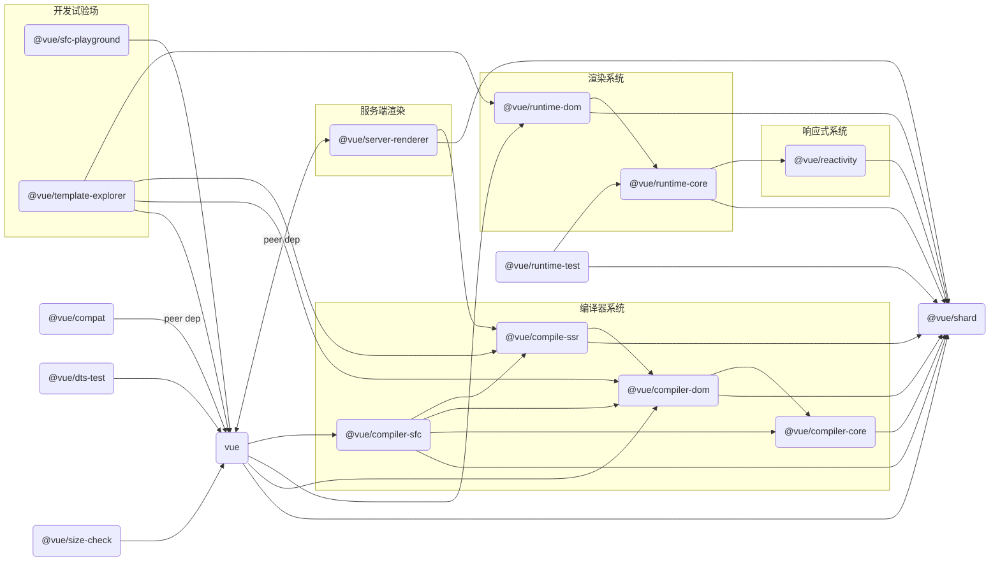

::: details 可略过的前言
在分析仓库之前，想过两种方式去阅读和书写。

- 按照整体工具链到对 script/\*里的脚本进行分析的顺序阅读
- 在了解[基本工具链](../start.md#开发工具链)后，通过 package.json 的 scripts 命令去分类分析，从而引出 script/\*里的脚本和每个脚本的使用以及基本实现，工具链以及包关系和用途

最后觉得第一种结构不太清晰并选择第二种方式进行阅读
:::

整个仓库是多包仓库，对于仓库分析，我们主要想要了解的方面是：

- 每个包的用途和它们之间的关系，或者说是基本的项目结构
- 除了代码核心功能(packages/\*里的包)外，其他的包括开发，测试，打包，发布包等辅助功能

## 包的用途及关系

关于每个包的用途，在[这里](https://github.com/vuejs/core/blob/main/.github/contributing.md#project-structure)其实已经讲了，我们简单过一遍后主要来梳理一下包的关系即可。

### 基本用途

- `reactivity`: 响应式系统包，**可以与框架分离单独使用(framework-agnostic)**。

- `runtime-core`: 包含了虚拟 dom 渲染器的实现，组件的实现以及暴露在外的基本 JavaScript APIs；可以通过此包**为不同的平台(platform-agnostic)**(e.g. 服务端或浏览器)进行自定义渲染器，所以也可以理解为高阶的运行时实现。

- `runtime-dom`: 主要用于处理浏览器原生 dom 的 api，特性(attributes)，属性(properties)和事件等。

- `runtime-test`: 轻量级运行时测试包；由于其只是渲染单纯的用 js 对象来表示的 dom 树，所以可以被用于任何 js 的运行环境；树可以用来断言任何正确的输出；此外还提供了一些用于序列化树，触发事件和记录真实 dom 节点在更新时的操作的工具函数。

- `server-renderer`: 服务端渲染用到的包。

- `compiler-core`: 与**平台无关(platform-agnostic)**(e.g. 服务端或浏览器)的核心编译逻辑实现，包含基本的编译器和所有的相关插件。

- `compiler-dom`: 包含额外用于浏览器的编译器插件。

- `compiler-sfc`: 提供用于编译 vue 单文件组件(scf)的底层工具函数包。
- `compiler-ssr`: 为服务端渲染生成优化过后的 render 函数。

- `shared`: 内部多包共享的工具函数包，尤其是跟**环境无关**的被用于**运行时和编译器**相关包的工具函数。

- `vue`: 最终公开完全打包的并包含运行时和编译系统的包，也就是我们用户导入了那个 vue。

- `compat`: 用于兼容 vue2 的 vue3 包；用 vue2 的模式编写代码，但用 vue3 的打包，让用户逐渐迁移到 vue3。

其他私有的工具包:

- `dts-test`: 包含了面向所有生成的 dts 文件的类型测试。
- `sfc-playground`: 通过 github 持续集成(CI)的 vue[在线演练场](https://play.vuejs.org)，`nr dev-sfc`进行开发。

- `template-explorer`: 用于开发和 debug 的[编译器转译工具](https://template-explorer.vuejs.org/)(模版 -> js 表示和 ast)，也是通过 CI 部署的。

- `size-check`: 用于在 CI 时检查打包后资源的大小。

### 基本关系

通过包之间的引用关系，我们可以很快地根据 package.json 里的依赖得出以下基本关系：

:::tip 说明
不包含仅有类型依赖的关系，虽然在最终打包出来的.d.ts 中会需要 import 对应的类型依赖包，但是会通过`peerDependencies`来确保此依赖包已经安装。

例如对于`server-render`里引用了`@vue/runtime-core`的类型，但并没有在`dependencies`字段加入它，而是在`peerDependencies`确保了`vue`包的安装以确保`@vue/runtime-core`的安装。

::: details 关于 peerDependencies
npm versions 1, 2, and 7 will automatically install peerDependencies if they are not explicitly depended upon higher in the dependency tree. For npm versions 3 through 6, you will receive a warning that the peerDependency is not installed instead.
:::



## 仓库功能

我们直接看`package.json`里有哪些 scripts：

::: code-group

```json [开发]
{
  "dev": "node scripts/dev.js",
  "dev-esm": "node scripts/dev.js -if esm-bundler-runtime",
  "dev-compiler": "run-p \"dev template-explorer\" serve",
  "dev-sfc": "run-s dev-sfc-prepare dev-sfc-run",
  "dev-sfc-prepare": "node scripts/pre-dev-sfc.js || npm run build-compiler-cjs",
  "dev-sfc-serve": "vite packages/sfc-playground --host",
  "dev-sfc-run": "run-p \"dev compiler-sfc -f esm-browser\" \"dev vue -if esm-bundler-runtime\" \"dev server-renderer -if esm-bundler\" dev-sfc-serve",
  "serve": "serve",
  "open": "open http://localhost:5000/packages/template-explorer/local.html"
}
```

```json [打包]
{
  "build": "node scripts/build.js",
  "build-dts": "tsc -p tsconfig.build.json && rollup -c rollup.dts.config.js",
  "build-sfc-playground": "run-s build-compiler-cjs build-runtime-esm build-ssr-esm build-sfc-playground-self",
  "build-compiler-cjs": "node scripts/build.js compiler reactivity-transform shared -af cjs",
  "build-runtime-esm": "node scripts/build.js runtime reactivity shared -af esm-bundler && node scripts/build.js vue -f esm-bundler-runtime && node scripts/build.js vue -f esm-browser-runtime",
  "build-ssr-esm": "node scripts/build.js compiler-sfc server-renderer -f esm-browser",
  "build-sfc-playground-self": "cd packages/sfc-playground && npm run build",

  "size": "run-s size-global size-baseline",
  "size-global": "node scripts/build.js vue runtime-dom -f global -p",
  "size-baseline": "node scripts/build.js vue -f esm-bundler-runtime && node scripts/build.js runtime-dom runtime-core reactivity shared -f esm-bundler && cd packages/size-check && vite build && node brotli"
}
```

```json [测试]
{
  "test": "vitest",
  "test-unit": "vitest -c vitest.unit.config.ts",
  "test-e2e": "node scripts/build.js vue -f global -d && vitest -c vitest.e2e.config.ts",
  "test-dts": "run-s build-dts test-dts-only",
  "test-dts-only": "tsc -p ./packages/dts-test/tsconfig.test.json",
  "test-coverage": "vitest -c vitest.unit.config.ts --coverage"
}
```

```json [发包]
{
  "release": "node scripts/release.js",
  "changelog": "conventional-changelog -p angular -i CHANGELOG.md -s"
}
```

```json [代码规范]
{
  "check": "tsc --incremental --noEmit",
  "lint": "eslint --cache --ext .ts packages/*/{src,__tests__}/**.ts",
  "format": "prettier --write --cache --parser typescript \"**/*.[tj]s?(x)\"",
  "format-check": "prettier --check --cache --parser typescript \"**/*.[tj]s?(x)\"",
  "preinstall": "node ./scripts/preinstall.js",
  "postinstall": "simple-git-hooks"
}
```

:::

以上就是所有涉及的脚本命令，通过分类可以看出主要有`开发`，`打包`，`测试`，`发包`和`规范`这几个用途。
接下来我们就按照这几个用途去了解每个命令都做了什么事，并引出在 scripts/\*下相关的脚本内容和使用方法。

## 总结

- 从包之间的关系中可以体现出`渲染系统`，`响应式系统`，`编译系统`以及`服务端渲染`模块之间的关系。
- 从`package.json`脚本中可以看出仓库的功能主要有`开发`，`打包`，`测试`，`发包`和`规范`。
