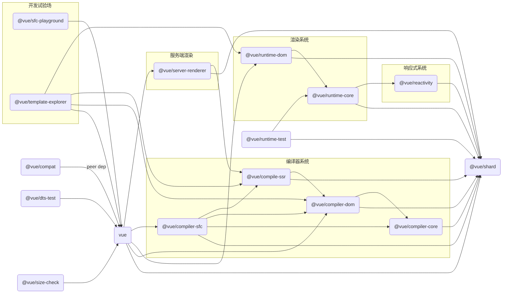

::: details 可略过的前言
在分析仓库之前，想过两种方式去阅读和书写。

- 按照整体工具链到对script/*里的脚本进行分析的顺序阅读
- 在了解[基本工具链](../start.md#开发工具链)后，通过package.json的scripts去分类分析，从而引出script/*里的脚本，工具链以及包关系和用途

最后觉得第一种结构不太清晰并选择第二种方式进行阅读
:::

整个仓库是多包仓库，对于仓库分析，我们主要想要了解的方面是：

- 每个包的用途和它们之间的关系，或者说是基本的项目结构
- 除了代码核心功能(packages/*里的包)外，其他的包括开发，测试，打包，发布包等辅助功能

## 包的用途及关系

关于每个包的用途，在[这里](https://github.com/s-elo/vue3-core/blob/main/.github/contributing.md#project-structure)其实已经讲了，我们简单过一遍后主要来梳理一下包的关系即可。

### 基本用途

- `reactivity`: 响应式系统包，**可以与框架分离单独使用(framework-agnostic)**。

- `runtime-core`: 包含了虚拟dom渲染器的实现，组件的实现以及暴露在外的基本JavaScript APIs；可以通过此包**为不同的平台(platform-agnostic)**(e.g. 服务端或浏览器)进行自定义渲染器，所以也可以理解为高阶的运行时实现。

- `runtime-dom`: 主要用于处理浏览器原生dom的api，特性(attributes)，属性(properties)和事件等。

- `runtime-test`: 轻量级运行时测试包；由于其只是渲染单纯的用js对象来表示的dom树，所以可以被用于任何js的运行环境；树可以用来断言任何正确的输出；此外还提供了一些用于序列化树，触发事件和记录真实dom节点在更新时的操作的工具函数。

- `server-renderer`: 服务端渲染用到的包。

- `compiler-core`: 与**平台无关(platform-agnostic)**(e.g. 服务端或浏览器)的核心编译逻辑实现，包含基本的编译器和所有的相关插件。

- `compiler-dom`: 包含额外用于浏览器的编译器插件。

- `compiler-sfc`: 提供用于编译vue单文件组件(scf)的底层工具函数包。
  
- `compiler-ssr`: 为服务端渲染生成优化过后的render函数。

- `shared`: 内部多包共享的工具函数包，尤其是跟**环境无关**的被用于**运行时和编译器**相关包的工具函数。

- `vue`: 最终公开完全打包的并包含运行时和编译系统的包，也就是我们用户导入了那个vue。

- `compat`: 用于兼容vue2的vue3包；用vue2的模式编写代码，但用vue3的打包，让用户逐渐迁移到vue3。

其他私有的工具包:

- `dts-test`: 包含了面向所有生成的dts文件的类型测试。
  
- `sfc-playground`: 通过github持续集成(CI)的vue[在线演练场](https://play.vuejs.org)，`nr dev-sfc`进行开发。

- `template-explorer`: 用于开发和debug的[编译器转译工具](https://template-explorer.vuejs.org/)(模版 -> js表示和ast)，也是通过CI部署的。

- `size-check`: 用于在CI时检查打包后资源的大小。

### 基本关系

通过包之间的引用关系，我们可以很快地根据package.json里的依赖得出以下基本关系：

:::tip 说明
不包含仅有类型依赖的关系，因为打包时会直接放到dts文件里，不会实际依赖被依赖类型的包，
所以真正发包时不需要安装仅类型被依赖的包。
:::

## 仓库功能
