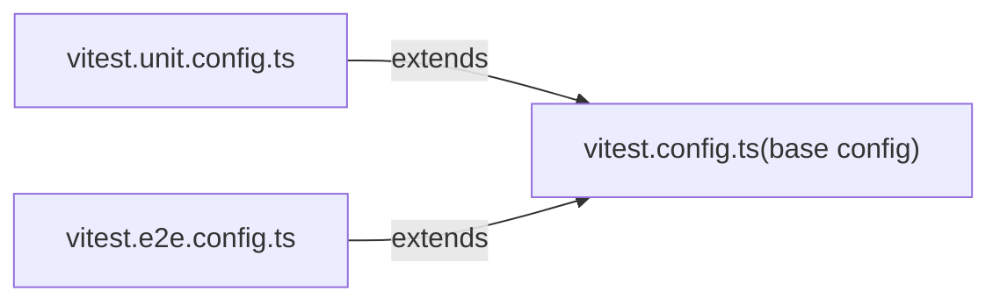

## 单测与 e2e

`vue3`的测试主要包括三种：`单测`，`e2e`和`类型测试`。其中`单测`和`e2e`都是通过配置`vitest`去进行测试的，配置区别只是包含不同的测试文件，基础配置都是一样的，`e2e`的测试都放在`__tests__/e2e`文件夹下。



```json
{
  "test-unit": "vitest -c vitest.unit.config.ts",
  "test-e2e": "node scripts/build.js vue -f global -d && vitest -c vitest.e2e.config.ts"
}
```

可以看到用 e2e 测试时需要先对`vue`包打包成`global`格式，环境为`dev`。

具体`单测`和`e2e`我们就不多说了，`类型测试`相对有趣些，我们主要来看看是如何进行类型测试的。

## 类型测试

```json
{
  "build-dts": "tsc -p tsconfig.build.json && rollup -c rollup.dts.config.js",
  "test-dts": "run-s build-dts test-dts-only",
  "test-dts-only": "tsc -p ./packages/dts-test/tsconfig.test.json"
}
```

我们可以通过执行`pnpm test-dts`来进行类型测试，其实就是通过`tsc --noEmit`(配置在`./packages/dts-test/tsconfig.test.json`)进行类型验证，确保类型的声明是正确的。所以`dts-test`下的文件都是`xxx.d.ts?x`文件。

但在验证之前，我们需要读取(引用)到对应的类型进行测试。由于配置的`moduleResolution`选项是`node`，即会按照`node`的找包方式进行包的定位，当我们引入其他包类型时如`import { h } from 'vue'`，我们会读取本地的`vue/dist/vue.d.ts`(在`package.json.types`字段指定了)去拿到对应的类型。**因此我们需要通过`build-dts`即打包类型声明文件命令来[打包类型](./build.md#打包类型声明)以确保引用的类型存在**。

::: warning
要确保引用的类型存在，我们只需要`pnpm build-dts`或者`pnpm build -t`就可以获取所有包的类型，但是需要注意的是，如果`temp/packages`里不小心将[不需要打包的包](./build.md#build)打包进来了，那么在执行类型打包时可能会找不到入口文件(`temp/packages/<package name>/src/index.d.ts`)而报错，此时只要删除掉`temp`文件夹重新执行`pnpm build-dts`或者`pnpm build -t`就 OK 了。
:::

## 工具类型

在类型测试中，我们会用到一些[工具类型](https://github.com/s-elo/vue3-core/blob/main/packages/dts-test/utils.d.ts)来进行类似单侧断言的效果。对于预期报错的类型判断，只要加上`\@ts-expect-error`即可。

- describe and test

```ts {1,2}
export function describe(_name: string, _fn: () => void): void
export function test(_name: string, _fn: () => any): void

describe('test h type', () => {
  test('should work', () => {
    const Foo = {
      props: {
        foo: String
      }
    }
    h(Foo, { foo: 'ok' })
  })
})
```

这两个函数类型只是为了能够更加语义化的进行类型测试。

- expectType

```ts {1}
export function expectType<T>(value: T): void

expectType<number>(666)
expectType<string>(666) // throw error
```

用来类型断言。
