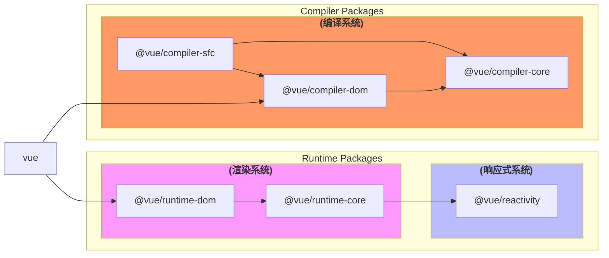

# 文档介绍

## 准备

### 阅读仓库

希望通过熟悉vue3整体仓库了解开源项目所需要的元素。
基于contributing.md里的[Development Setup](https://github.com/s-elo/vue3-core/blob/main/.github/contributing.md#development-setup); [Scripts](https://github.com/s-elo/vue3-core/blob/main/.github/contributing.md#scripts); [Project Structure](https://github.com/s-elo/vue3-core/blob/main/.github/contributing.md#project-structure)。主要了解项目在工程方面内容。

当然这部分不会有很大的篇幅，主要有以下几点：

#### **开发工具链**：

- [TypeScript](https://www.typescriptlang.org/) 作为开发语言
- [Vite](https://vitejs.dev/) 和 [ESBuild](https://esbuild.github.io/) 作为开发时的服务和打包工具
- [Rollup](https://rollupjs.org) 作为生产时的打包工具
- [Vitest](https://vitest.dev/) 作为单测工具
- [Prettier](https://prettier.io/) 作为代码格式化工具
- [ESLint](https://eslint.org/) 作为静态代码错误检查工具(不包含类型)

#### **脚本基本用途**

了解仓库里scripts/*里的脚本用途，熟悉仓库在工程方面有哪些工具可供使用。

#### **仓库代码组织结构**

阅读核心源码之前还是要先熟悉仓库整体结构的，包括每个包的基本用途，关系以及单元测试的编写等。

### [前置知识](./pre-knowledge/proxy)

在阅读核心源码之前，如果能够熟悉一些前置知识会更容易进行阅读。
目前文档的前置知识基本是从此[文档](https://vue3js.cn/start/)所写的内容搬运过来的。
也是看到此项目似乎已经停更，才想自己去接着阅读下去吧。

## 核心

这部分当然就是此文档的主要内容。

### 阅读方式

:::warning
阅读源码以及技术写作的方式可能会有所不足，在阅读以及输出内容的过程中很可能会不断的调整阅读方式以及内容的组织结构。非常欢迎其他小伙伴们在评论区提建议和讨论或者一起加入。
:::

就目前以仅有的知识和经验，阅读方式大致会按照如下进行：

**阅读方式**

对于vue来说有三大知名系统：`渲染系统(renderer)`，`响应式系统(reactivity)`和`编译系统(compiler)`。根据尤大提及的[包依赖关系](https://github.com/s-elo/vue3-core/blob/main/.github/contributing.md#package-dependencies)也可以看出此三大系统.

阅读的模块也是按照这三大系统来进行的，且将会按照在使用vue时执行的顺序进行(e.g. createApp -> mount -> render...)，从而引出三大系统的核心内容。

按照这个顺序，最先接触到的会是渲染系统，接着会涉及到响应式系统，二者可能会并行进行阅读分析。理论上来说，有了渲染系统和响应式系统就可以正常地进行[MVVM模式](https://www.ruanyifeng.com/blog/2015/02/mvcmvp_mvvm.html)工作了，所以编译系统以我的理解来看是与前二者相对较分离的，应该放在最后来阅读。

如果能够将三大系统的核心坚持读完，剩下的其他功能比如[SSR](https://vuejs.org/guide/scaling-up/ssr.html)，[动画](https://vuejs.org/guide/extras/animation.html#animation-techniques)，[Suspense](https://vuejs.org/guide/built-ins/suspense.html)等会再接着阅读学习。当然，在阅读核心系统时应该会不能避免的接触到其他相关代码。

## 关于语言

文档用中文书写，如果后面坚持完成了三大系统核心内容的梳理，会翻译为英文。
