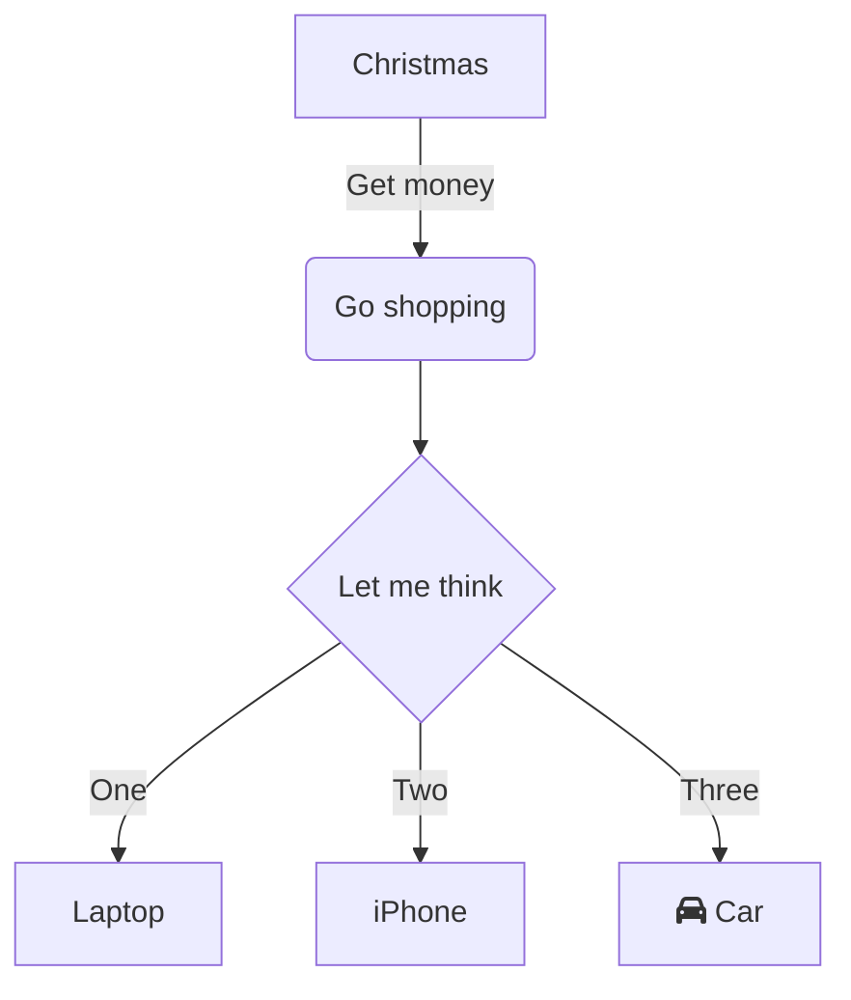

# 文档介绍

## 阅读仓库

希望通过熟悉vue3整体仓库了解开源项目所需要的元素。
基于contributing.md里的[Development Setup](https://github.com/s-elo/vue3-core/blob/main/.github/contributing.md#development-setup); [Scripts](https://github.com/s-elo/vue3-core/blob/main/.github/contributing.md#scripts); [Project Structure](https://github.com/s-elo/vue3-core/blob/main/.github/contributing.md#project-structure)

**开发工具链**：

- [TypeScript](https://www.typescriptlang.org/) as the development language
- [Vite](https://vitejs.dev/) and [ESBuild](https://esbuild.github.io/) for development bundling
- [Rollup](https://rollupjs.org) for production bundling
- [Vitest](https://vitest.dev/) for unit testing
- [Prettier](https://prettier.io/) for code formatting
- [ESLint](https://eslint.org/) for static error prevention (outside of types)

**脚本基本用途**

了解仓库里scripts/*里的脚本用途，熟悉仓库在工程方面有哪些工具可供使用。

**仓库代码组织结构**

阅读核心源码之前还是要先熟悉仓库整体结构的，包括每个包的基本用途，关系等。

